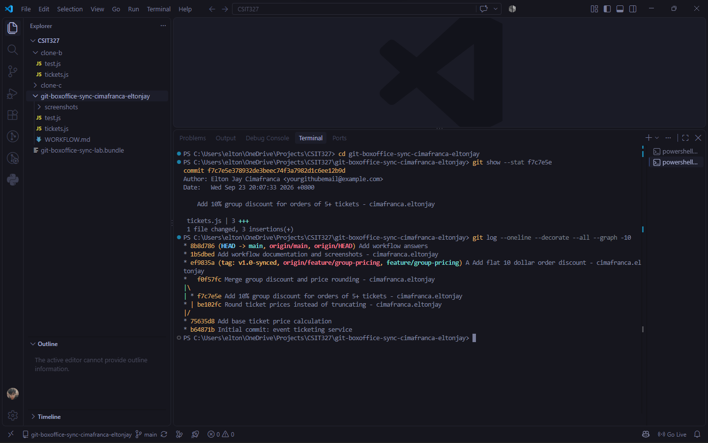
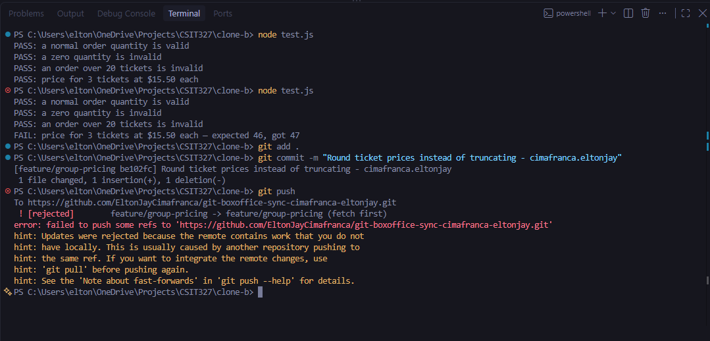
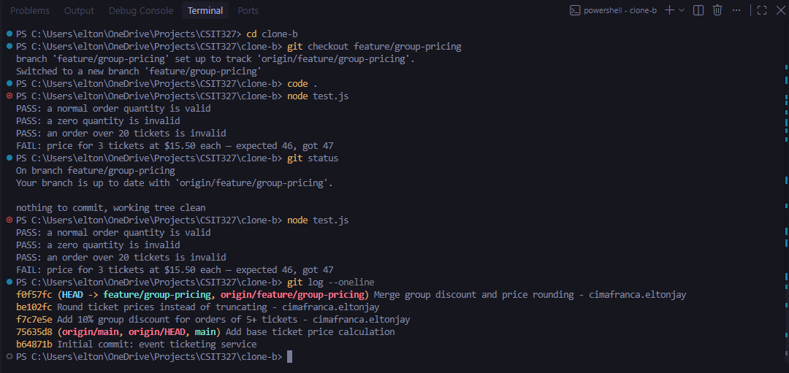
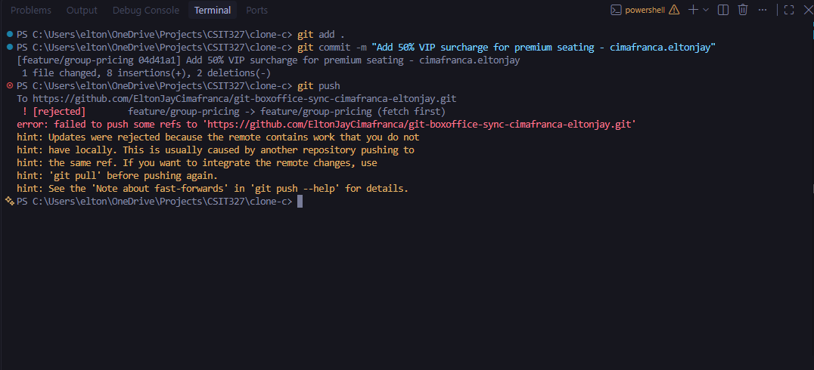
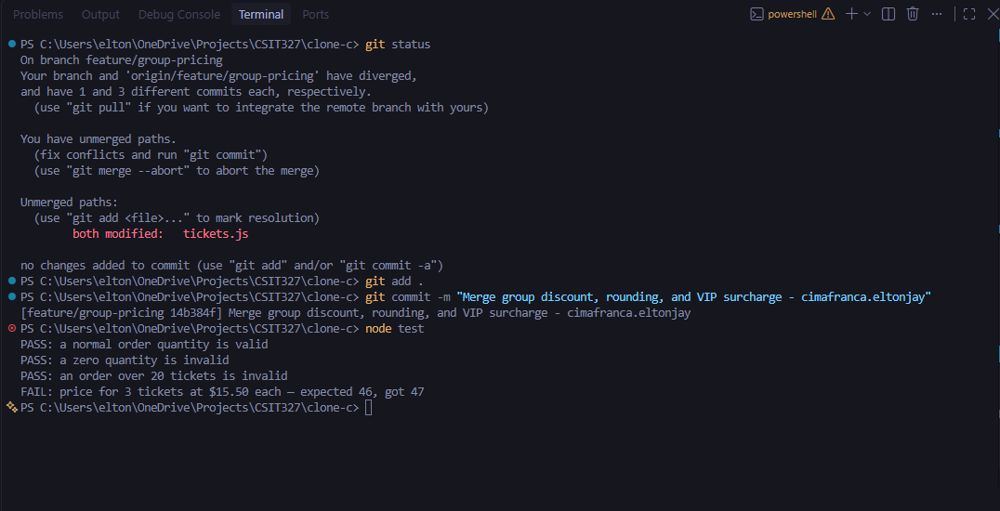
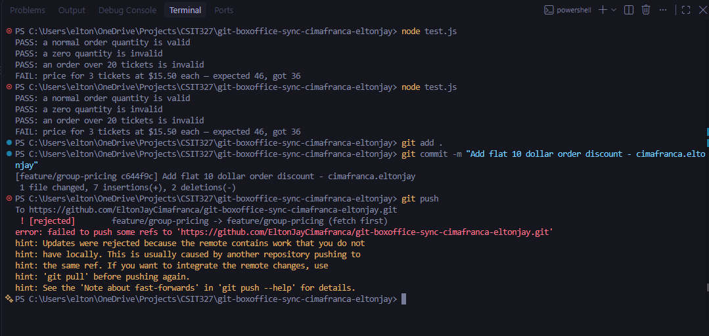
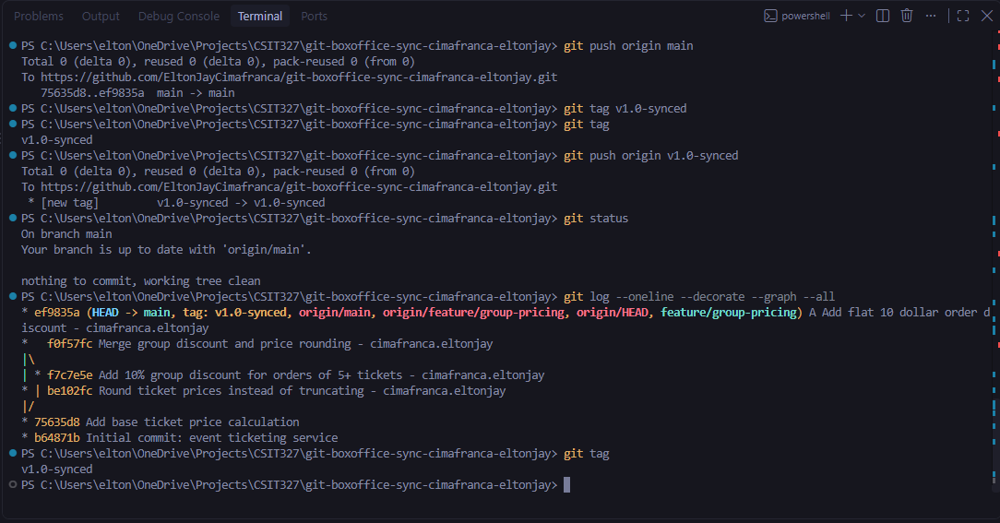

# Box Office Sync: Workflow

## Task 1 to Task 7 Screenshots

### Task 1

### Task 2

### Task 3

### Task 4

### Task 5

### Task 6

### Task 7

## 1. Walk through the final `calculateTicketPrice` function

The final `calculateTicketPrice()` function contains changes from all three contributors, along with the final flat discount.

The group-pricing contributor added a 10% discount for orders with 5 or more tickets, so qualifying group orders get a 10% price reduction.

The rounding contributor changed how the price is handled so that the final price is rounded instead of truncated.

The VIP contributor added a 50% surcharge for premium or VIP seating, which increases the price by 50%.

Lastly, the final change added a flat $10 discount to the order price. Overall, the final function keeps all four changes and shows how multiple changes can affect the same part of the code.

## 2. Task 3 vs. Task 5

Task 3 was a two-way conflict between the group discount and rounding changes. I just needed to compare the two versions of the code and make sure that both changes were kept.

Task 5 was harder because a third contributor made another change after the branch had already been modified twice. This meant I had to deal with three different changes: the group discount, rounding, and VIP surcharge. I had to understand and carefully change and combine them without accidentally removing any of them.

The main difficulty was that the final code could not simply choose the current or incoming version. I had to manually combine the conflicting code so that all three changes were included in the final version.

## 3. Why did the $10 discount affect unrelated tests?

The flat $10 discount changed the final result produced by `calculateTicketPrice()`. Even though the new change was supposed to be a separate discount, the group-discount and VIP tests also use the same function to calculate the ticket price.

Because the tests depend on the same function, adding the extra discount also changed their expected results.

This shows that changes are not always isolated when they involve shared code. A developer might think they are only changing one feature, but the change can also affect other features and tests that depend on the same calculation.

## 4. What process change would have prevented the rejected pushes?

A simple way to improve the process is to make sure everyone syncs their branch before starting work. Each contributor can fetch the latest changes and update their local branch before making and pushing their own changes.

The team can also make it a habit to regularly pull or rebase their work before pushing. This can reduce differences between branches and make conflicts easier to handle.

The most important thing is to communicate and stay synchronized, especially when several people are working on the same code.